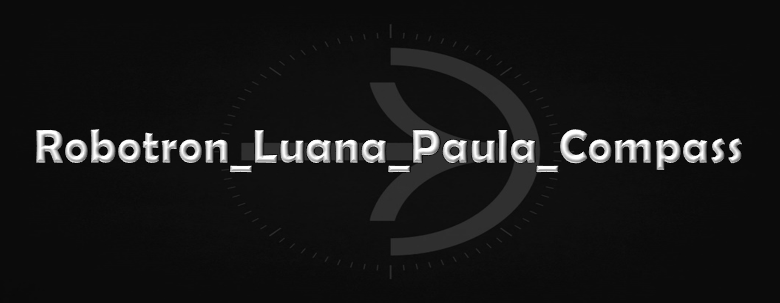

# Challenge
Este repositório contem as atividades referentes ao challenge da sprint 04 (Technology Core PYTHON).
- `Lista 1 (dia 5)`: possui 12 exercicios que buscam treinar a lógica e sintaxe com o python.
- `Lista 2 (dia 7)`: possui 15 exercicios e um desafio final que buscam treinar a manipulação de arquivos json e csv no python.

## Pré requisitos
- Python 3.x
- Python modulos:
  - json
  - pandas

## Referências
Todos os exercícios foram feitos com base no material fornecido ao longo da sprint e com conhecimentos prévios. Os que utilizaram alguma pesquisa adicional para seu funcionamento estão devidamente referenciadas ao final do código.
